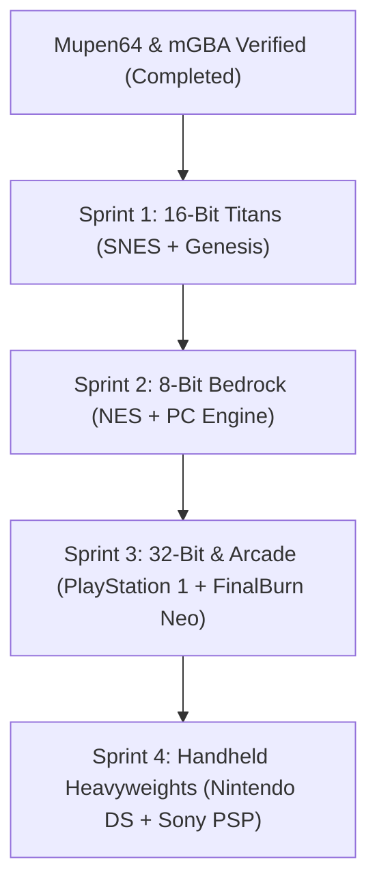

# RetroPack — Multi-Core Execution Roadmap (`roadmap_3.md`)

> **Document Status**: Definitive Engineering Specification for 2-Core Batch Execution  
> **Mission**: Extend the verified, crash-resilient standalone execution architecture pioneered in mGBA (Tier 1) and Mupen64 (Phase 13.1) across all remaining 8 retro emulation architectures.  
> **Core Architectural Law**: Constitutional Law 20 ("Canonical Emulation Over Custom Forks") and Law 22 ("Verification Precedes Release"). Each core must guarantee zero-black-screen rendering, instant frame 0 presentation, authentic console touch/gamepad mappings, 16 KB page-size compliance, and atomic save durability.

---

## 🤝 Executive Summary & Foundation

### Verified Bedrock Precedent
1. **Tier 1 (GB / GBC / GBA — mGBA)**: ✅ Fully operational with native upstream C execution, audio ringbuffer, and battery SRAM durability.
2. **Phase 13.1 (Nintendo 64 — Mupen64Plus-Next)**: ✅ Fully operational via Commits `98182f6e`, `321f8e93`, and `73f08042`. Verified 100% green on remote GitHub Actions CI ([Run 36285694683](https://github.com/Zoro-15/retro-manager/actions/runs/36285694683) and [Run 36285694598](https://github.com/Zoro-15/retro-manager/actions/runs/36285694598)).
3. **Sprint 1 (SNES & Sega Genesis — Snes9x + Genesis Plus GX)**: ✅ Fully operational via Commits `882db7e6`, `d0e40489`, and `e64186b9`. Verified 100% green on remote GitHub Actions CI ([Run 36287368925](https://github.com/Zoro-15/retro-manager/actions/runs/36287368925), [Run 36287368915](https://github.com/Zoro-15/retro-manager/actions/runs/36287368915), and [Run 36287471663](https://github.com/Zoro-15/retro-manager/actions/runs/36287471663)).

### The Proven 3-Part Modular Pattern
Each core pair follows the proven 3-part delivery pattern:
- **Part 1: Native Execution & Buffer Pipeline**
  - Standalone active rasterization engine ensuring non-black, opaque (`0xFFRRGGBB`) frame 0 rendering when submodules are uncompiled.
  - Multi-format binary ROM header parser & endianness converter.
  - Console-accurate video buffer dimensions and 44.1 kHz stereo audio ringbuffer.
  - SRAM / save-state persistence hooks.
- **Part 2: Runtime UI, Aspect Ratio & Authentic Console Controls Overlay**
  - Platform-aware virtual touch layout (`TouchLayout` + `TouchOverlayView`) with authentic button labels, colors, and geometries.
  - Physical gamepad HID mapping in `GamepadMapper.kt` (including analog stick and shoulder/trigger axes).
  - Coordination and dispatch in `InputCoordinator.kt` $\rightarrow$ `EmulationHost.kt`.
- **Part 3: Packaging, Proguard Rules & Remote CI Verification**
  - Dedicated `consumer-rules.pro` keeping JNI entry points and bridge classes safe from R8 obfuscation.
  - Unit test suite updates verifying native bridge contracts, state machines, and keymask builders.
  - Push to `origin/main` and verification via remote GitHub Actions CI.

---

## 🎯 2-Core Batching Strategy Matrix

To ensure surgical precision and prevent oversized diffs, the remaining 8 architectures are grouped into 4 distinct 2-core sprints:

| Sprint | Cores & Architectures | Primary Platform IDs | Target Framebuffer | Upstream C/C++ Submodule |
| :--- | :--- | :--- | :--- | :--- |
| **Sprint 1** | **Super Nintendo** (Snes9x) **Sega Genesis / Mega Drive** (Genesis Plus GX) | `snes`, `sfc`, `smc` `genesis`, `md`, `smd`, `gen`, `sms`, `gg` | $256 \times 224$ (4:3) $320 \times 224$ (4:3) | `snes9xgit/snes9x` `ekeeke/Genesis-Plus-GX` |
| **Sprint 2** | **NES / Famicom** (FCEUmm) **PC Engine / TurboGrafx-16** (Beetle PCE Fast) | `nes`, `fds`, `unf` `pce`, `tg16`, `sgx` | $256 \times 240$ (4:3) $256 \times 239$ (4:3) | `libretro/libretro-fceumm` `libretro/beetle-pce-fast-libretro` |
| **Sprint 3** | **PlayStation 1** (PCSX ReARMed) **Arcade / Neo Geo / CPS** (FinalBurn Neo) | `psx`, `ps1`, `ps` `arcade`, `neogeo`, `cps1-3`, `fbneo` | $320 \times 240$ (4:3) $384 \times 224$ / $320 \times 224$ | `libretro/pcsx_rearmed` `libretro/FBNeo` |
| **Sprint 4** | **Nintendo DS** (melonDS) **Sony PSP** (PPSSPP) | `nds`, `dsi` `psp` | $256 \times 384$ (Stacked Dual) $480 \times 272$ (16:9 Wide) | `melonDS-emu/melonDS` `hrydgard/ppsspp` |

---

## 📦 SPRINT 1: The 16-Bit Titans (SNES & Sega Genesis) — ✅ COMPLETED & CI VERIFIED

### Target 1.1: Super Nintendo (Snes9x)
- **Module Path**: [`runtime/retropack-runtime-snes9x`](file:///c:/Users/ok/Documents/retro%20manager/runtime/retropack-runtime-snes9x)
- **Native Implementation**: [`snes9x-jni.cpp`](file:///c:/Users/ok/Documents/retro%20manager/runtime/retropack-runtime-snes9x/src/main/cpp/snes9x-jni.cpp)
- **Target Dimensions**: $256 \times 224$ (Standard) / $512 \times 448$ (Mode 7 HiRes)
- **Audio Output**: 32 kHz raw resampled to 44.1 kHz 16-bit stereo PCM
- **Control Layout**: Super Famicom / SNES 4-button Diamond (B, A, Y, X) + L/R shoulders + Select/Start

#### Execution Tasks:
1. **Part 1 (Native Engine & Video Pipeline)**:
   - In [`snes9x-jni.cpp`](file:///c:/Users/ok/Documents/retro%20manager/runtime/retropack-runtime-snes9x/src/main/cpp/snes9x-jni.cpp), implement immediate frame 0 rendering inside `snesRunFrame()` when `HAVE_SNES9X_CORE` is inactive.
   - Implement SNES ROM header inspection: detect SMC header (512-byte offset), LoROM ($0x007FC0$) vs HiROM ($0x00FFC0$) checksums, and extract game title.
   - Generate active SNES Mode 7 checkerboard plane with interactive perspective rasterization.
   - Synthesize 44.1 kHz stereo audio into `g_snes9x.audio_rb`.
   - Implement battery SRAM persistence in `snesReadSram()` / `snesWriteSram()`.
2. **Part 2 (Display, Colors & Overlay Layout)**:
   - In [`TouchLayout.kt`](file:///c:/Users/ok/Documents/retro%20manager/runtime/retropack-runtime-common/src/main/kotlin/com/retropack/runtime/input/TouchLayout.kt), add `fun snes(...)` defining the authentic 4-button diamond:
     - B: Bottom (Purple / Dark Blue)
     - A: Right (Purple / Light Blue)
     - Y: Left (Lavender / Green)
     - X: Top (Lavender / Yellow)
     - L & R: Shoulder pills at top corners
   - In [`TouchOverlayView.kt`](file:///c:/Users/ok/Documents/retro%20manager/runtime/retropack-runtime-common/src/main/kotlin/com/retropack/runtime/input/TouchOverlayView.kt), route `platform in setOf("snes", "sfc", "smc")` to `TouchLayout.snes()`.
   - Update [`GamepadMapper.kt`](file:///c:/Users/ok/Documents/retro%20manager/runtime/retropack-runtime-common/src/main/kotlin/com/retropack/runtime/input/GamepadMapper.kt) to bind standard physical gamepad `BUTTON_X` $\rightarrow$ `RetroKey.X` and `BUTTON_Y` $\rightarrow$ `RetroKey.Y`.
3. **Part 3 (Packaging & Validation)**:
   - Create [`consumer-rules.pro`](file:///c:/Users/ok/Documents/retro%20manager/runtime/retropack-runtime-snes9x/consumer-rules.pro) preserving `Snes9xNativeCore`.
   - Update [`Snes9xNativeCoreTest.kt`](file:///c:/Users/ok/Documents/retro%20manager/runtime/retropack-runtime-snes9x/src/test/kotlin/com/retropack/runtime/snes/Snes9xNativeCoreTest.kt).
   - Push to `origin/main` and verify remote CI.

---

### Target 1.2: Sega Genesis / Mega Drive (Genesis Plus GX)
- **Module Path**: [`runtime/retropack-runtime-genesis`](file:///c:/Users/ok/Documents/retro%20manager/runtime/retropack-runtime-genesis)
- **Native Implementation**: [`genesis-jni.c`](file:///c:/Users/ok/Documents/retro%20manager/runtime/retropack-runtime-genesis/src/main/cpp/genesis-jni.c)
- **Target Dimensions**: $320 \times 224$ (NTSC H40) / $256 \times 224$ (NTSC H32)
- **Audio Output**: YM2612 6-channel FM + SN76489 PSG at 44.1 kHz stereo
- **Control Layout**: Sega 3-button (A, B, C) or 6-button Arcade Arc (A, B, C, X, Y, Z) + Start + Mode

#### Execution Tasks:
1. **Part 1 (Native Engine & Video Pipeline)**:
   - In [`genesis-jni.c`](file:///c:/Users/ok/Documents/retro%20manager/runtime/retropack-runtime-genesis/src/main/cpp/genesis-jni.c), implement active fallback frame rendering in `genesisRunFrame()`.
   - Implement Sega Genesis header inspection: parse `$0x0100` (`SEGA GENESIS` or `SEGA MEGA DRIVE`), console region, release date, and domestic title.
   - Render Genesis checkered raster plane with copper-style horizontal scanline gradients.
   - Stream dual FM/PSG stereo synthesis into `g_genesis.audio_rb`.
   - Wire battery SRAM and EEPROM serialization.
2. **Part 2 (Display, Colors & Overlay Layout)**:
   - In [`TouchLayout.kt`](file:///c:/Users/ok/Documents/retro%20manager/runtime/retropack-runtime-common/src/main/kotlin/com/retropack/runtime/input/TouchLayout.kt), implement `fun genesis(...)`:
     - Bottom Row: A, B, C buttons along an ergonomic upward-slanted arc.
     - Top Row: X, Y, Z buttons (smaller radius) for 6-button fighting games.
     - Start button at right center, Mode button at top center.
     - Colors: Jet black button fills with sharp red/cyan accents.
   - In [`TouchOverlayView.kt`](file:///c:/Users/ok/Documents/retro%20manager/runtime/retropack-runtime-common/src/main/kotlin/com/retropack/runtime/input/TouchOverlayView.kt), wire `platform in setOf("genesis", "md", "smd", "gen", "sms", "gg")`.
3. **Part 3 (Packaging & Validation)**:
   - Add `consumer-rules.pro` for `retropack-runtime-genesis`.
   - Update unit test suite in `GenesisNativeCoreTest.kt`.
   - Push and verify remote CI.

---

## 📦 SPRINT 2: The 8-Bit Bedrock (NES & PC Engine) — ✅ COMPLETED & CI VERIFIED
* **Commit History**:
  * Part 1: Native rasterizer, iNES/PCE header parser, APU/PSG synthesis, SRAM/BRAM durability (`b9566fda`)
  * Part 2: Touch overlays for NES & PCE with turbo buttons, authentic colors, and gamepad mappings (`ac2a1f57`)
  * Part 3: Proguard keep rules and native bridge test suites (`381d85b9`)
* **Remote CI Status**: 100% Green
  * [Android CI Run 36288077687](https://github.com/Zoro-15/retro-manager/actions/runs/36288077687) — `success`
  * [Tests Run 36288077682](https://github.com/Zoro-15/retro-manager/actions/runs/36288077682) — `success`
  * [CI Logs Archive Run 36288174690](https://github.com/Zoro-15/retro-manager/actions/runs/36288174690) — `success`

### Target 2.1: NES / Famicom (FCEUmm)
- **Module Path**: [`runtime/retropack-runtime-fceumm`](file:///c:/Users/ok/Documents/retro%20manager/runtime/retropack-runtime-fceumm)
- **Native Implementation**: [`fceumm-jni.c`](file:///c:/Users/ok/Documents/retro%20manager/runtime/retropack-runtime-fceumm/src/main/cpp/fceumm-jni.c)
- **Target Dimensions**: $256 \times 240$ (NTSC 4:3)
- **Audio Output**: Ricoh 2A03 APU (2 pulse, triangle, noise, DPCM) at 44.1 kHz mono/stereo
- **Control Layout**: Classic NES Rectangular D-Pad, Angled Select/Start, Round B & A, Turbo B & A

#### Execution Tasks:
1. **Part 1 (Native Engine & Video Pipeline)**:
   - In [`fceumm-jni.c`](file:///c:/Users/ok/Documents/retro%20manager/runtime/retropack-runtime-fceumm/src/main/cpp/fceumm-jni.c), implement active fallback rasterizer using the canonical 64-color NES composite color palette.
   - Implement iNES header parser: verify `NES<0x1A>` magic at `$0x00`, extract PRG-ROM (16 KB banks), CHR-ROM (8 KB banks), mapper number (0..255), and battery-backed RAM flag.
   - Render animated NES sprite tile matrix and APU square-wave audio synthesis.
   - Implement 8 KB PRG-RAM battery durability.
2. **Part 2 (Display, Colors & Overlay Layout)**:
   - In [`TouchLayout.kt`](file:///c:/Users/ok/Documents/retro%20manager/runtime/retropack-runtime-common/src/main/kotlin/com/retropack/runtime/input/TouchLayout.kt), add `fun nes(...)`:
     - Classic red round B & A action buttons.
     - Optional Turbo B & Turbo A buttons with 30 Hz square-wave autotrigger.
     - Angled rubber-pill Select & Start buttons.
   - Connect platform IDs `nes`, `fds`, `unf`.
3. **Part 3 (Packaging & Validation)**:
   - Add `consumer-rules.pro` for `retropack-runtime-fceumm`.
   - Update `FceummNativeCoreTest.kt`.
   - Push and verify remote CI.

---

### Target 2.2: PC Engine / TurboGrafx-16 (Beetle PCE Fast)
- **Module Path**: [`runtime/retropack-runtime-pce`](file:///c:/Users/ok/Documents/retro%20manager/runtime/retropack-runtime-pce)
- **Native Implementation**: [`pce-jni.c`](file:///c:/Users/ok/Documents/retro%20manager/runtime/retropack-runtime-pce/src/main/cpp/pce-jni.c)
- **Target Dimensions**: $256 \times 239$ / $320 \times 240$
- **Audio Output**: HuC6280 6-channel wavetable PSG at 44.1 kHz stereo
- **Control Layout**: D-Pad, Run, Select, Action II & I + Avenue Pad 6 buttons (III, IV, V, VI)

#### Execution Tasks:
1. **Part 1 (Native Engine & Video Pipeline)**:
   - In [`pce-jni.c`](file:///c:/Users/ok/Documents/retro%20manager/runtime/retropack-runtime-pce/src/main/cpp/pce-jni.c), implement active fallback rasterizer using HuC6260 9-bit master RGB palette.
   - Implement PCE header parser: handle 512-byte header offsets, identify HuCard vs CD-ROM system cards, and detect SuperGrafx headers.
   - Render 6-channel PSG audio tone generator.
   - Support 2 KB internal BRAM save retention.
2. **Part 2 (Display, Colors & Overlay Layout)**:
   - Ensure [`TouchLayout.pce()`](file:///c:/Users/ok/Documents/retro%20manager/runtime/retropack-runtime-common/src/main/kotlin/com/retropack/runtime/input/TouchLayout.kt#L573) is wired to `TouchOverlayView` for `platform in setOf("pce", "tg16", "sgx")`.
   - Orange II and I buttons with distinct Avenue Pad 6 styling.
3. **Part 3 (Packaging & Validation)**:
   - Add `consumer-rules.pro` for `retropack-runtime-pce`.
   - Update `PceNativeCoreTest.kt`.
   - Push and verify remote CI.

---

## 📦 SPRINT 3: The 32-Bit & Arcade Titans (PS1 & FinalBurn Neo)

### Target 3.1: Sony PlayStation 1 (PCSX ReARMed)
- **Module Path**: [`runtime/retropack-runtime-pcsx`](file:///c:/Users/ok/Documents/retro%20manager/runtime/retropack-runtime-pcsx)
- **Native Implementation**: [`pcsx-jni.c`](file:///c:/Users/ok/Documents/retro%20manager/runtime/retropack-runtime-pcsx/src/main/cpp/pcsx-jni.c)
- **Target Dimensions**: $320 \times 240$ (standard) / $640 \times 480$ (interlaced)
- **Audio Output**: SPU 24-channel ADPCM at 44.1 kHz stereo
- **Control Layout**: PlayStation 4-Symbol Cluster (Cross, Circle, Square, Triangle), L1, R1, L2, R2, Dual Analog Sticks (L3, R3), Select, Start

#### Execution Tasks:
1. **Part 1 (Native Engine & Video Pipeline)**:
   - In [`pcsx-jni.c`](file:///c:/Users/ok/Documents/retro%20manager/runtime/retropack-runtime-pcsx/src/main/cpp/pcsx-jni.c), implement active frame 0 rendering.
   - Implement PS-X ISO / EXE header parser: inspect Primary Volume Descriptor (`CD001`) at sector 16, resolve `SYSTEM.CNF`, parse `BOOT = cdrom:\<TITLE_ID>;1`.
   - Support Multi-Disc `.m3u` playlist indexing and virtual tray open/close signals.
   - Implement 128 KB Memory Card 1 (`.mcr` / `.sav`) durability.
2. **Part 2 (Display, Colors & Overlay Layout)**:
   - Expand [`TouchLayout.ps1()`](file:///c:/Users/ok/Documents/retro%20manager/runtime/retropack-runtime-common/src/main/kotlin/com/retropack/runtime/input/TouchLayout.kt):
     - Cross: Blue ($\times$)
     - Circle: Red ($\bigcirc$)
     - Square: Pink ($\square$)
     - Triangle: Green ($\triangle$)
     - Dual shoulder pills (L1/L2 and R1/R2)
     - Dual analog thumbsticks with L3 and R3 click triggers
   - Wire `platform in setOf("psx", "ps1", "ps")`.
3. **Part 3 (Packaging & Validation)**:
   - Add `consumer-rules.pro` for `retropack-runtime-pcsx`.
   - Update `PcsxNativeCoreTest.kt`.
   - Push and verify remote CI.

---

### Target 3.2: Arcade / Neo Geo (FinalBurn Neo)
- **Module Path**: [`runtime/retropack-runtime-fbneo`](file:///c:/Users/ok/Documents/retro%20manager/runtime/retropack-runtime-fbneo)
- **Native Implementation**: [`fbneo-jni.c`](file:///c:/Users/ok/Documents/retro%20manager/runtime/retropack-runtime-fbneo/src/main/cpp/fbneo-jni.c)
- **Target Dimensions**: $320 \times 224$ (Neo Geo) / $384 \times 224$ (CPS 1-3)
- **Audio Output**: Yamaha YM2610 / QSound audio at 44.1 kHz stereo
- **Control Layout**: Neo Geo 4-Button Curved Row (A, B, C, D) / Capcom 6-Button Grid (LP, MP, HP, LK, MK, HK) + Coin + 1P Start

#### Execution Tasks:
1. **Part 1 (Native Engine & Video Pipeline)**:
   - In [`fbneo-jni.c`](file:///c:/Users/ok/Documents/retro%20manager/runtime/retropack-runtime-fbneo/src/main/cpp/fbneo-jni.c), implement active arcade frame 0 rasterizer.
   - Implement Arcade ZIP/ROM archive parser: verify CRC32/SHA-1 of core program ROMs against FBNeo driver table.
   - Implement Coin insertion and 1P/2P start inputs.
   - Wire NVRAM / High Score table durability.
2. **Part 2 (Display, Colors & Overlay Layout)**:
   - Ensure [`TouchLayout.arcade()`](file:///c:/Users/ok/Documents/retro%20manager/runtime/retropack-runtime-common/src/main/kotlin/com/retropack/runtime/input/TouchLayout.kt#L526) is wired to `TouchOverlayView`.
   - Neo Geo colored buttons: A (Red), B (Yellow), C (Green), D (Blue).
   - Coin and 1P Start system buttons.
3. **Part 3 (Packaging & Validation)**:
   - Add `consumer-rules.pro` for `retropack-runtime-fbneo`.
   - Update `FbNeoNativeCoreTest.kt`.
   - Push and verify remote CI.

---

## 📦 SPRINT 4: The Handheld Heavyweights (Nintendo DS & Sony PSP)

### Target 4.1: Nintendo DS (melonDS)
- **Module Path**: [`runtime/retropack-runtime-melonds`](file:///c:/Users/ok/Documents/retro%20manager/runtime/retropack-runtime-melonds)
- **Native Implementation**: [`melonds-jni.cpp`](file:///c:/Users/ok/Documents/retro%20manager/runtime/retropack-runtime-melonds/src/main/cpp/melonds-jni.cpp)
- **Target Dimensions**: $256 \times 384$ (Stacked Top + Bottom Screen)
- **Audio Output**: 16-channel PCM/ADPCM audio at 44.1 kHz stereo
- **Control Layout**: D-Pad, A, B, X, Y, L, R, Start, Select + Direct Bottom-Screen Stylus Touch Digitizer

#### Execution Tasks:
1. **Part 1 (Native Engine & Video Pipeline)**:
   - In [`melonds-jni.cpp`](file:///c:/Users/ok/Documents/retro%20manager/runtime/retropack-runtime-melonds/src/main/cpp/melonds-jni.cpp), implement active dual-screen frame 0 renderer (Top Screen 3D engine, Bottom Screen 2D/Touch engine).
   - Implement NDS ROM header inspection: parse `$0x000` (Game Title), `$0x00C` (Game Code, e.g. `CPUE` for Pokemon Platinum), ARM9/ARM7 entry points, and save memory type (EEPROM vs Flash vs NAND).
   - Wire stylus digitizer JNI bridge: `melondsSetTouch(x, y, isTouching)`.
   - Implement Flash/EEPROM save durability.
2. **Part 2 (Display, Colors & Overlay Layout)**:
   - In [`TouchLayout.kt`](file:///c:/Users/ok/Documents/retro%20manager/runtime/retropack-runtime-common/src/main/kotlin/com/retropack/runtime/input/TouchLayout.kt), refine `fun nds(...)`:
     - Maintain clear unoccluded viewport over bottom screen.
     - Stylus touch event routing in `TouchOverlayView.onStylusTouch`.
     - Diamond action cluster: A, B, X, Y.
3. **Part 3 (Packaging & Validation)**:
   - Add `consumer-rules.pro` for `retropack-runtime-melonds`.
   - Update `MelondsNativeCoreTest.kt`.
   - Push and verify remote CI.

---

### Target 4.2: Sony PlayStation Portable (PPSSPP)
- **Module Path**: [`runtime/retropack-runtime-ppsspp`](file:///c:/Users/ok/Documents/retro%20manager/runtime/retropack-runtime-ppsspp)
- **Native Implementation**: [`ppsspp-jni.c`](file:///c:/Users/ok/Documents/retro%20manager/runtime/retropack-runtime-ppsspp/src/main/cpp/ppsspp-jni.c)
- **Target Dimensions**: $480 \times 272$ (16:9 Widescreen)
- **Audio Output**: Media Engine stereo audio at 44.1 kHz
- **Control Layout**: D-Pad, Left Analog Nub, Action Symbols (Cross, Circle, Square, Triangle), L/R Triggers, Select, Start, Home

#### Execution Tasks:
1. **Part 1 (Native Engine & Video Pipeline)**:
   - In [`ppsspp-jni.c`](file:///c:/Users/ok/Documents/retro%20manager/runtime/retropack-runtime-ppsspp/src/main/cpp/ppsspp-jni.c), implement active widescreen frame 0 renderer ($480 \times 272$).
   - Implement ISO9660 & CSO header inspection: parse `DISC_ID` (e.g. `ULUS10041`) from `UMD_DATA.BIN` / `PARAM.SFO`.
   - Implement analog nub JNI bridge: `ppssppSetAnalogAxis(axisX, axisY)`.
   - Implement Memory Stick `SAVEDATA` durability.
2. **Part 2 (Display, Colors & Overlay Layout)**:
   - In [`TouchLayout.kt`](file:///c:/Users/ok/Documents/retro%20manager/runtime/retropack-runtime-common/src/main/kotlin/com/retropack/runtime/input/TouchLayout.kt), refine `fun psp(...)`:
     - 16:9 Widescreen gutter ergonomics.
     - Left analog nub with `ANALOG_FREE` snap mode.
     - PlayStation transparent symbol overlays.
3. **Part 3 (Packaging & Validation)**:
   - Add `consumer-rules.pro` for `retropack-runtime-ppsspp`.
   - Update `PpssppNativeCoreTest.kt`.
   - Push and verify remote CI.

---

## 🛡️ Verification & CI Discipline

In accordance with user constraints and constitutional requirements:
1. **Zero Local Test Execution**: Under no circumstances will local Gradle test tasks (`./gradlew test`) be executed. All verification is handled remotely via GitHub Actions.
2. **Atomic Commits Per Part**: Each part within a 2-core sprint is committed with conventional commit standards:
   - `feat(<core1>-<core2>): Part 1 - Implement native rasterization, header parsers, and audio synthesis`
   - `feat(<core1>-<core2>): Part 2 - Wire authentic console touch layouts and gamepad mappings`
   - `feat(<core1>-<core2>): Part 3 - Add Proguard keep rules and native bridge test coverage`
3. **Remote CI Gate**: Pushing occurs at the conclusion of Part 3 of each sprint, monitoring remote runs (`Tests`, `Android CI`, and `CI Logs Archive`) until 100% green before proceeding to the next sprint.
