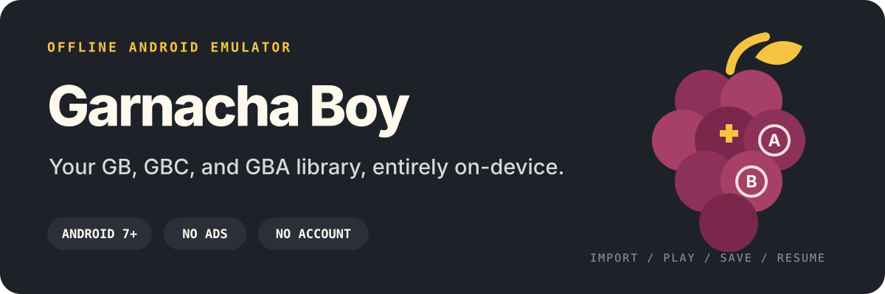
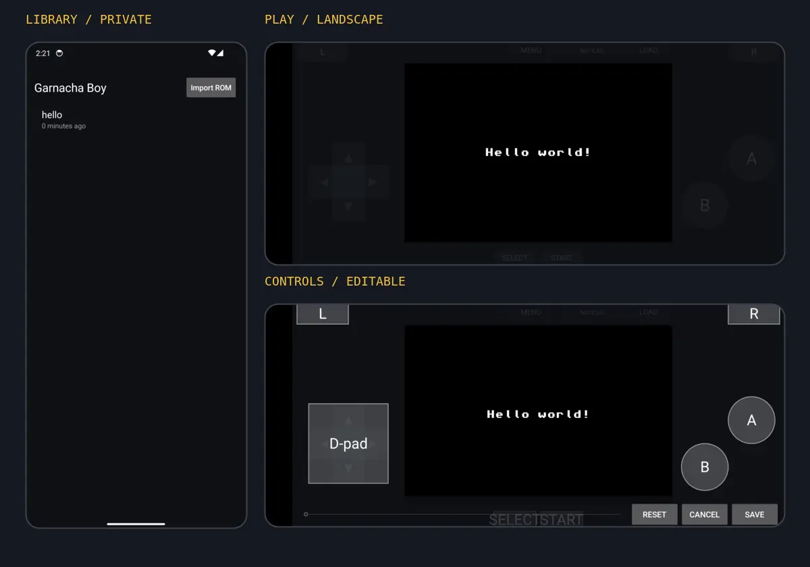
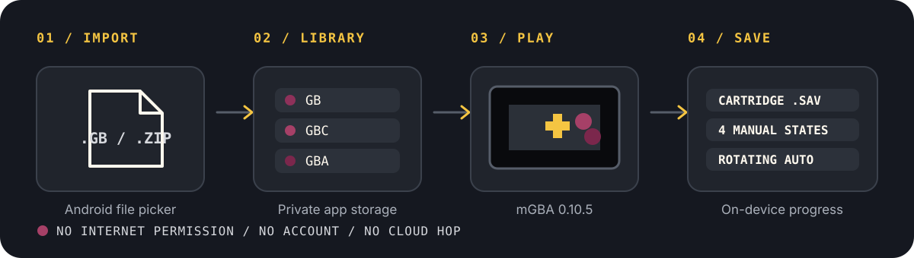

<p align="center">
  
</p>

<p align="center">
  <strong>Bring your own games. Keep your library and progress on your phone.</strong><br>
  Free, ad-free, account-free, and built around canonical mGBA.
</p>

<p align="center">
  <a href="https://github.com/TrebuchetDynamics/garnacha-boy-android/tree/v0.6.2"><strong>Source v0.6.2</strong></a> ·
  <a href="#see-it-running">Screens</a> ·
  <a href="#from-file-to-save">How it works</a> ·
  <a href="#built-to-stay-offline">Privacy</a> ·
  <a href="#build-from-source">Build</a>
</p>

## Release status

**Latest release: [`v0.6.2`](https://github.com/TrebuchetDynamics/garnacha-boy-android/releases/tag/v0.6.2).** Download the production-signed APK and corresponding source archive from GitHub Releases.

Trust official builds only from [GitHub Releases](https://github.com/TrebuchetDynamics/garnacha-boy-android/releases); do not install APKs distributed elsewhere.

## See it running

<p align="center">
  
</p>

<p align="center"><sub>Validated development builds using open test ROMs; no commercial game content is included.</sub></p>

## One library, three systems

Import a `.gb`, `.gbc`, `.gba`, or ZIP file through Android's document picker. Garnacha Boy detects the system from the ROM itself, keeps a private local copy, and opens every game from one recently-played library.

- **Game Boy, Game Boy Color, and Game Boy Advance** through pinned, unmodified [mGBA](https://github.com/mgba-emu/mgba) `0.10.5`
- **Cartridge saves** plus four manual save-state slots
- **Save export** to a user-chosen ZIP file
- **Rotating autosaves** for resume and recovery
- **Rewind and fast-forward** from the in-game menu
- **Touch and physical controls** with remapping support
- **Clean screenshots** saved to Android's Pictures collection

## From file to save

<p align="center">
  
</p>

Once Garnacha Boy is installed:

1. Tap **Import game** and choose a game file you are authorized to use.
2. Tap the new library entry to play.
3. Use **Game menu** for save states, rewind, fast-forward, screenshots, and settings.
4. Return later and resume from the library or a rotating autosave.

## Tune it to your hands

- Edit touch-control position, size, and opacity independently for portrait and landscape
- Add custom multi-input or turbo buttons
- Remap connected controller buttons
- Choose automatic, portrait, or landscape orientation
- Use crisp integer scaling or fill-screen scaling
- Select a Game Boy palette, volume, frameskip, and fast-forward speed
- Hide touch controls after idle or when a gamepad is connected

## Built to stay offline

Garnacha Boy's Android manifest intentionally has **no `INTERNET` permission**. There is no account, telemetry, advertising SDK, cloud dependency, or online service in the play path.

| Data | Where it goes |
|---|---|
| Imported games | App-private storage |
| Cartridge saves and save states | App-private storage |
| Library and play history | App-private storage |
| Screenshots | Android Pictures collection |
| Network traffic | None—the app has no network permission |

> Cloud backup is disabled. On Android 10 or newer, the uninstall screen asks whether to keep Garnacha Boy's on-device data. Choose **Keep app data** to retain the library, saves, states, and settings for reinstalling; deleting a game from the library still removes its private copy and associated saves.

## Compatibility and limits

| | Current support |
|---|---|
| Android | 7.0 or newer (`minSdk 24`) |
| Device architectures | `arm64-v8a` and `x86_64` |
| Game files | `.gb`, `.gbc`, `.gba`, and ZIP imports |
| Emulator core | mGBA `0.10.5` |

- Games and proprietary BIOS files are not included. Supply only content you are legally authorized to use.
- Bluetooth and USB controller remapping exists, but physical-controller coverage remains limited.
- Battery life, sustained thermals, and low-end Android performance remain unverified.

## Build from source

<details>
<summary><strong>Developer requirements, commands, and outputs</strong></summary>

### Requirements

JDK 17, Android SDK 35, NDK `22.1.7171670`, CMake `3.18.1`, and Ninja.

```sh
git submodule update --init --recursive
android/gradlew -p android clean lintDebug \
  :app:testDebugUnitTest :app:assembleBenchmark \
  :core:assembleBenchmark :core:assembleDebugAndroidTest

cmake -S android/smoke -B build/mgba-smoke -G Ninja \
  -DCMAKE_BUILD_TYPE=Release
cmake --build build/mgba-smoke
ctest --test-dir build/mgba-smoke --output-on-failure
```

Outputs:

- optimized debug-signed APK: `android/app/build/outputs/apk/benchmark/app-benchmark.apk`
- reusable mGBA AAR: `android/core/build/outputs/aar/core-benchmark.aar`

The benchmark APK is not a production release. Tagged releases use [`.github/workflows/release.yml`](.github/workflows/release.yml), which fails closed unless all production-signing secrets are configured and attaches a corresponding-source archive containing the pinned mGBA submodule.

[](https://github.com/TrebuchetDynamics/garnacha-boy-android/actions/workflows/deploy_android.yml)
[](https://github.com/TrebuchetDynamics/garnacha-boy-android/actions/workflows/release.yml)

See [`android/README.md`](android/README.md) for implementation details, [`MVP.md`](MVP.md) for the build contract, and [`docs/validation/`](docs/validation/) for device-test receipts.

</details>

## Open source and legal

Garnacha Boy is provided under the [MIT License](LICENSE). Its pinned, unmodified [mGBA](https://github.com/mgba-emu/mgba/tree/26b7884bc25a5933960f3cdcd98bac1ae14d42e2) core remains under MPL-2.0; the full mGBA license and exact source revision ship in the app and AAR notices. See [`ACKNOWLEDGMENTS.md`](ACKNOWLEDGMENTS.md) for attribution details.

Garnacha Boy is not affiliated with or endorsed by Nintendo or mGBA.
